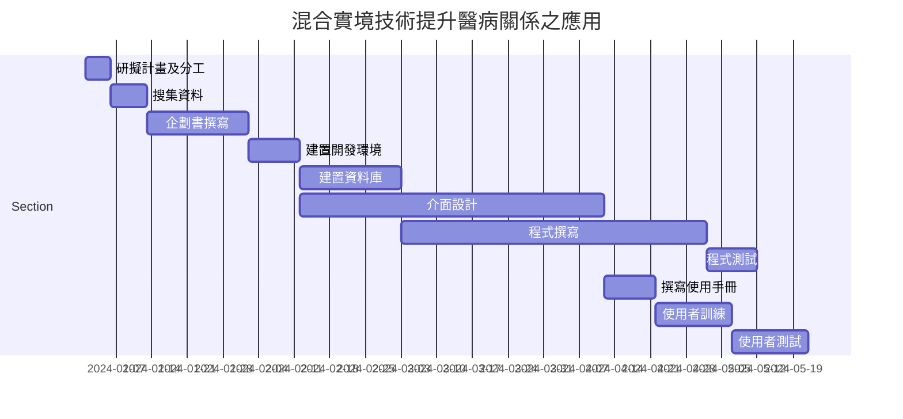

# Team2

# 分配圖

#  甘特圖 
### Mermaid

```mermaid
gantt
    title 混合實境技術提升醫病關係之應用

    section Section
    研擬計畫及分工  :a1, 2024-01-01,5d
    搜集資料       :a2, after a1,7d
    企劃書撰寫      :a3, after a2,20d
    建置開發環境    :a4, after a3,10d
    建置資料庫      :a5, after a4,20d
    介面設計        :a6, after a4,60d
    程式撰寫        :a7, after a5,60d
    程式測試        :a8, after a7,10d
    撰寫使用手冊     :a9, after a6,10d
    使用者訓練       :a10, after a9,15d
    使用者測試       :a11, after a10,15d
```
#  PERT圖

# 關鍵路徑

1-2-3-4-5-7-10-11
