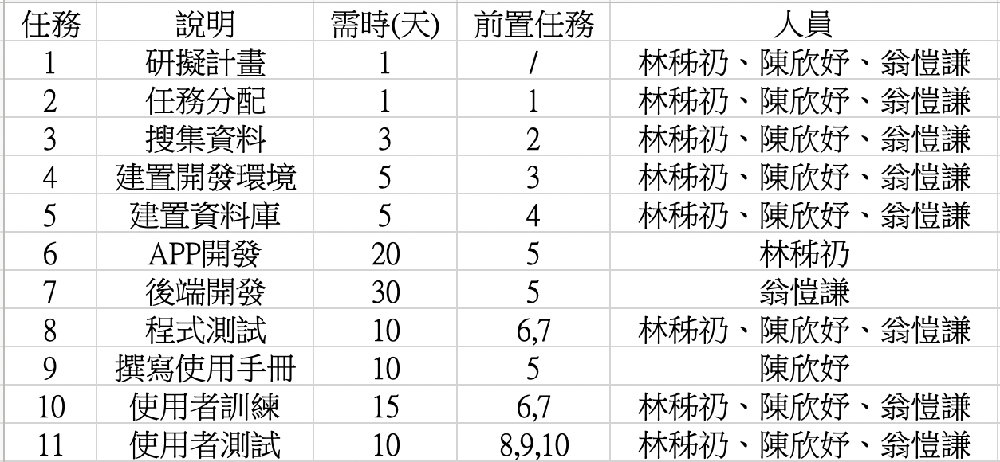
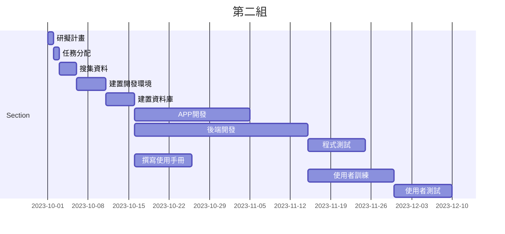
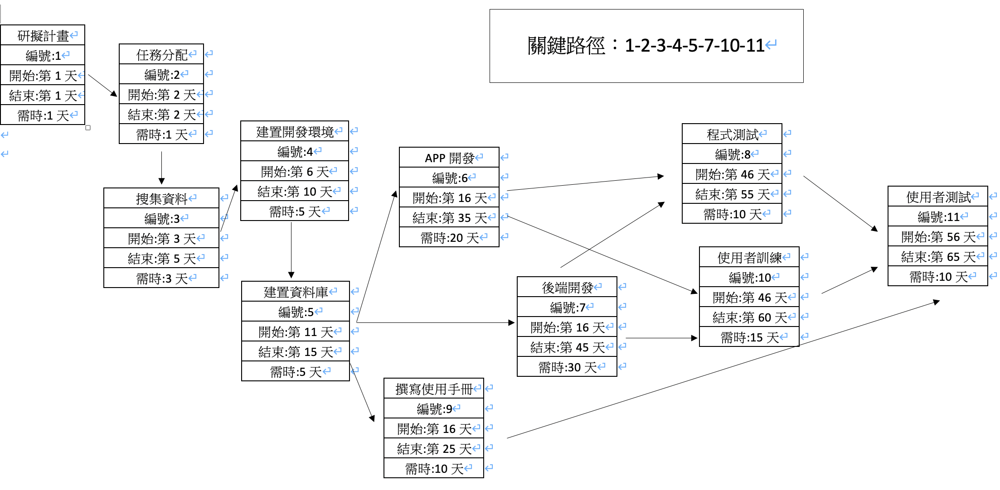

# Team2

# 分配圖

#  甘特圖 
### Mermaid

```mermaid
gantt
    title 第二組

    section Section
    研擬計畫       :a1, 2023-10-01,1d
    任務分配       :a2, after a1,1d
    搜集資料       :a3, after a2,3d
    建置開發環境    :a4, after a3,5d
    建置資料庫      :a5, after a4,5d
    APP開發        :a6, after a5,20d
    後端開發        :a7, after a5,30d
    程式測試        :a8, after a7,10d
    撰寫使用手冊     :a9, after a5,10d
    使用者訓練       :a10, after a7,15d
    使用者測試       :a11, after a10,10d
```
#  PERT圖

# 關鍵路徑

1-2-3-4-5-7-10-11
