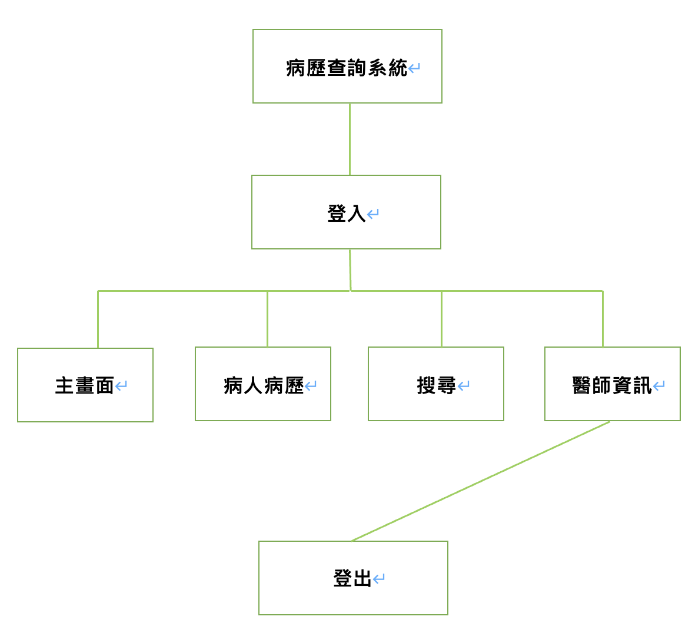
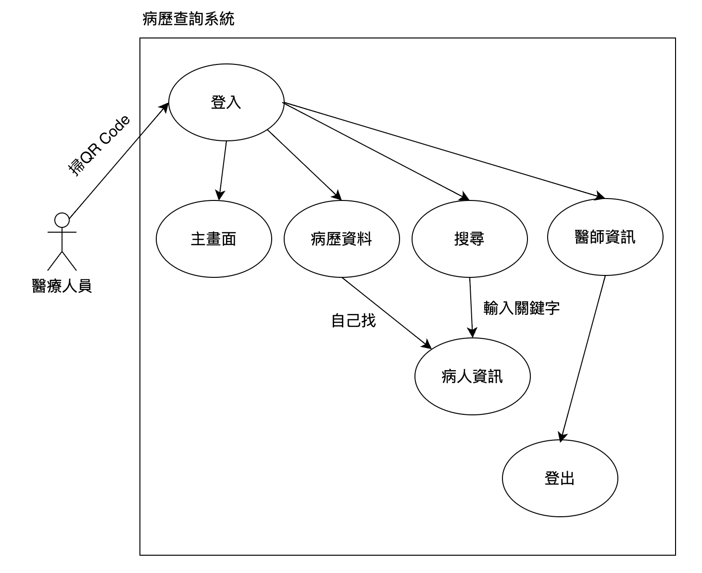
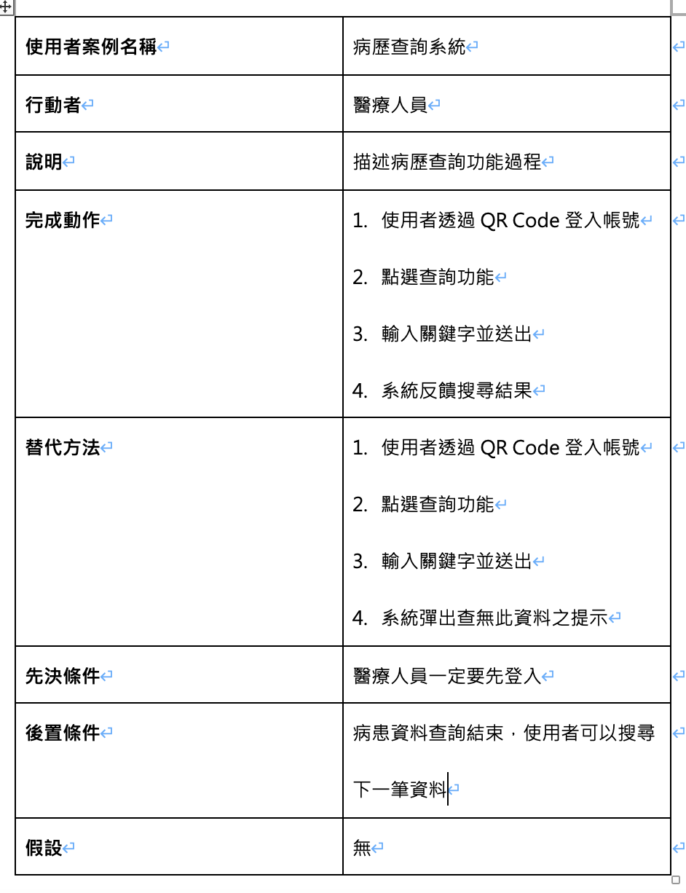

# 功能的需求
    登入：讓醫護人員可以用自己的帳號登入系統
    主畫面(佈告欄)：顯示院內的公告事項
    病歷資料：可以看到關於病人的所有資料
    搜尋功能：可以搜尋特定病人的資料
    醫師資訊：醫師的個人資訊
    登出：不使用的時候就可以登出

# 非功能的需求
    反應時間：五秒內
    使用性：上手快速大約30分鐘內
    可靠度：一年內的當機時間不超過30分鐘
    維護性：命名標準-駝峰式命名
  
# 功能分解圖

# 需求分析的文字描述
    第一個：使用者可以透過登出存取系統
    第二個：使用者可以透過主畫面了解院內資訊
    第三個：使用者可以透過病歷資料找尋病歷
    第四個：使用者可以透過關鍵字搜尋特定病歷
    第五個：使用者可以看自己的個人資訊跟登出

# 使用案例圖

# Figma
